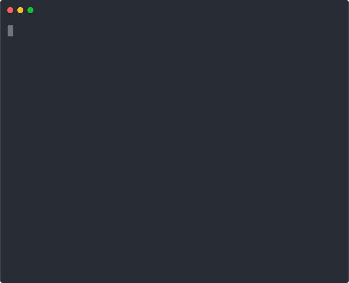

<!-- markdownlint-configure-file {
  "MD013": {
    "code_blocks": false,
    "tables": false
  },
  "MD033": false,
  "MD041": false
} -->

<div align="center">

# goto

<!-- [![Downloads][downloads-badge]][releases]
[![License][license-badge]][license] -->

🪄 A cli tool to **magically** goto folders and clone github repos

[Getting started](#getting-started) •
[Installation](#installation) •
[Configuration](#configuration)

</div>

## Getting Started

<div align="center">
  
</div>

When you run goto for the first time, it will prompt for a default `dev` directory of your choice

After that it automatically jumps to folders and clones the github repo if needed

## Installation

> You will also need [the github cli](https://cli.github.com/) in order to list and clone repos

### _Step 1: Install goto_

```sh
npm i -g @ajhenry/goto
```

### _Step 2: Add goto to your shell_

To start using goto, add it to your shell.

Add this to your configuration (usually `~/.zshrc` or `~/.bashrc`):

```sh
eval "$(goto-cli --init)"
```

## How it works

You have to set a default dev directory like `~/dev` or `~/projects`.

After that, once you type in `goto project-name` it will first check if the directory exists.

If the directory does not exist, it will search github and clone the repo.

If that also fails, it will ask if you want to create it.

## Configuration

The following flags are available:

```sh
-> goto -h
USAGE
  $ goto [PATH] [-l] [-p] [-u] [-d] [-i] [-v]

FLAGS
  -d, --debug   Enable debug output
  -i, --init    Initializes the goto function for bash
  -l, --list    List all repos
  -p, --path    List the default dev directory
  -u, --update  Update the default dev directory
  -v, --version  Prints the version number
```

## Developing

This setups a development environment for you

```sh
npm i
npm link
npm run dev

# Now you can run the wrapper cli
goto-cli -v
```

Any changes that you make will be available immediately via the wrapper

## Generating Pretty Terminal Output

Install these packages

```sh
brew install asciinema
npm i -g svg-term-cli
```

Run these commands to generate the output

```sh
asciinema rec ~/.goto/test.json --overwrite
svg-term --in  ~/.goto/test.json --out resources/terminal.svg --window
```

## License

MIT
